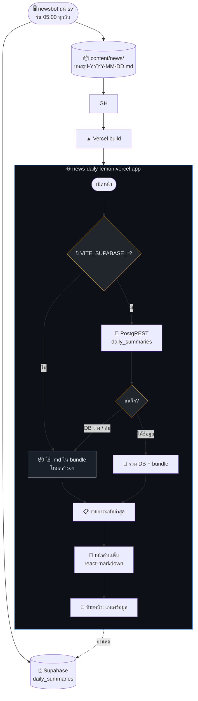
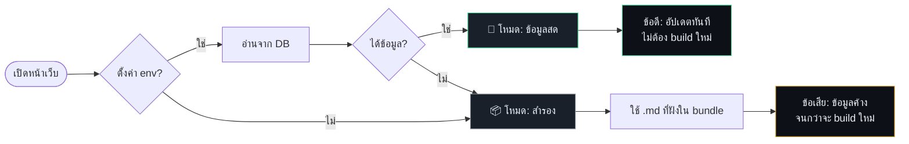

# News Daily — หน้าเว็บบทสรุปข่าว

🔗 **เว็บ**: https://news-daily-lemon.vercel.app

บทสรุป**ข่าวคริปโต** BTC · ETH · SOL — ระบบ `newsbot` บนเครื่อง `sv` สร้างอัตโนมัติทุกวัน 07:00

> repo นี้มี **UI อย่างเดียว** — โค้ด Python อยู่ที่ Gitea `Ex3-NeoPulse/news-bot` (ห้ามรวมกันตามกฎของทีม)

---

## Flow chart



---

## การแชร์

ปุ่มแชร์ 3 ปุ่ม ไม่ใช้ API key ใดๆ

| ปุ่ม | วิธีทำงาน |
|---|---|
| **แชร์ Facebook** | เปิด dialog ของ Facebook (ผู้ใช้กดโพสต์เอง) |
| **แชร์** | Web Share API — มือถือขึ้น native share sheet |
| **คัดลอกลิงก์** | clipboard + ขึ้น "คัดลอกแล้ว" |

วางที่: ใต้หัวเรื่อง + ท้ายบทความ (หน้าอ่านเต็ม) · ครั้งเดียว (หน้ารายการ ฉบับล่าสุด)

### เส้นทางของเว็บ

```
/อ่าน/2026-10-01        ← URL จริง (ไม่ใช้ #)
/                       ← หน้ารายการ
```

> **ทำไมไม่ใช้ `#/...`**: Facebook ตัดส่วน `#` ทิ้งตอนแชร์ → คนกดลิงก์จะไปหน้าแรกแทนที่จะไปบทความที่แชร์
> เลยใช้ URL จริง + `vercel.json` มี rewrite ให้ทุก path มาที่ `index.html`

## โครงสร้าง

```
index.html                        ← จุดเริ่มต้น
vercel.json                       ← framework/build/output ที่ Vercel ใช้
src/
├── main.jsx                      ← mount React
├── App.jsx                       ← routing (hash) + theme + โหลดข้อมูล async
├── content-source.js             ← ★ ตัวตัดสินใจ: DB หรือ bundle
├── content.js                    ← อ่าน .md ทั้งหมดตอน build (import.meta.glob)
├── lib/
│   ├── supabase.js               ← ★ อ่าน DB ผ่าน PostgREST
│   └── router.js                 ← ★ เส้นทาง URL จริง (แทน hash)
├── components/
│   └── ShareButtons.jsx          ← ★ ปุ่มแชร์ 3 ปุ่ม
├── components/
│   ├── HomeView.jsx              ← หน้ารายการ (ฉบับล่าสุด + ฉบับก่อนหน้า)
│   └── ArticleView.jsx           ← หน้าอ่านเต็ม + front-matter
└── styles.css                    ← ธีมสว่าง/มืด + responsive

content/news/บทสรุป-YYYY-MM-DD.md  ← บอทเขียนไฟล์นี้ (fallback)
```

| ไฟล์สำคัญ | หน้าที่ |
|---|---|
| `content-source.js` | ลองอ่าน DB ก่อน → ถ้าไม่ได้ (ไม่มี env / DB ว่าง / DB ล่ม) ใช้ไฟล์ `.md` ใน bundle |
| `lib/supabase.js` | เรียก PostgREST ด้วย anon key · ตัด front-matter ออกเพราะ React แสดงเอง |
| `content.js` | ฝังไฟล์ `.md` ทั้งหมดเข้า bundle ตอน build (โหมดสำรอง) |

---

## การอ่านข้อมูล — 2 โหมด



ดูสถานะได้ท้ายหน้า:
- **"ข้อมูลสดจากฐานข้อมูล"** = อ่าน DB สำเร็จ
- **"โหมดสำรอง"** = ใช้ไฟล์ใน bundle

---

## ฐานข้อมูล (Supabase)

หน้าเว็บอ่านผ่าน **PostgREST** โดยตรง — ไม่มี server ไม่มี API key ที่ต้องซ่อน

| ตัวแปร | ค่า |
|---|---|
| `VITE_SUPABASE_URL` | `https://<ref>.supabase.co` |
| `VITE_SUPABASE_ANON_KEY` | anon key (public โดย design) |

ใส่ใน `.env.local` (ไม่ commit) หรือเป็น Environment Variables บน Vercel

### ทำไม anon key ใส่ใน browser ได้

anon key เป็น **public โดย design** — ปลอดภัยเพราะ **RLS** กำหนดสิทธิ์ไว้:

| ตาราง | anon อ่าน | anon เขียน |
|---|---|---|
| `daily_summaries` (บทสรุป) | ✅ | ❌ |
| `summary_news` (ผูก) | ✅ | ❌ |
| `news_items` (ข่าวดิบ) | ❌ | ❌ |
| view รวมข่าว | ❌ | ❌ |

> ทดสอบจริงแล้ว: `daily_summaries` → 200 · `news_items` → `[]` · view → 401 · INSERT → 401

ถ้าอยากย้ายไปฝั่ง server ภายหลัง ให้เพิ่ม API route ใน Vercel แล้วซ่อน key ไว้ฝั่งนั้น

---

## คำสั่ง

```bash
npm install
npm run dev        # โหมดพัฒนา (port 5173)
npm run build      # build เป็น static → dist/
npm run preview    # ทดสอบ build
```

### Vite อ่าน env ตอน build

> ⚠️ **ต้อง Redeploy หลังเพิ่ม env บน Vercel**
> Vite อ่านค่า `VITE_*` **ตอน build** เท่านั้น — เพิ่มใน Vercel แล้วไม่ redeploy จะไม่มีผล
>
> ⚠️ **ต้องขึ้นต้นด้วย `VITE_`**
> ตัวแปรชื่อ `SUPABASE_ANON_KEY` (ไม่มี prefix) browser จะมองไม่เห็น

---

## เทคโนโลยี

| ส่วน | เวอร์ชัน | หมายเหตุ |
|---|---|---|
| Vite | 8.3.1 | `npm audit` = 0 vulnerabilities |
| React | 19.3.0 | — |
| react-markdown | 10.1.0 | + remark-gfm (ตาราง/ลิสต์) |
| เส้นทาง | hash routing | `#/บทสรุป-2026-09-30` · ไม่ต้องตั้ง rewrite บน server |
| ผลลัพธ์ build | ~400 KB (gzip 122 KB) | static ล้วน ไม่มี server |

---

## การแยกบัญชีและอีเมล

| บัญชี | ที่อยู่ | อีเมลที่ commit | ดูแลอะไร |
|---|---|---|---|
| **FahSai** (ฟ้า) | sv | `grids.developer@gmail.com` | repo นี้ — UI + ผลลัพธ์ `.md` |
| **Ex3-NeoPulse** | Gitea | `2024.3xxx@gmail.com` | โค้ด Python บอท |

ตามกฎอีเมลใน `AGENTS.md` — ฟ้าใช้ `grids.developer@gmail.com` เท่านั้น
ส่วนโค้ด Python เป็นของ Ex3-NeoPulse (Python Tools) ตาม `company-org-structure`

---

## กฎที่ต้องยึด

- **ห้ามมี Python ใน repo นี้** — แยกจากโค้ดบอทตามกฎของทีม
- **repo ต้องเป็น PUBLIC** — ถ้าเป็น private จะถูก Vercel block deployment
  > พิสูจน์แล้ว 2026-09-30: เปลี่ยนเป็น public → `success — Deployment has completed` ทันที
- **ห้าม commit `.env.local`** — อยู่ใน `.gitignore` แล้ว
- **ไม่เก็บ secret ใดๆ ใน repo** — ตรวจแล้วไม่มี service_role หรือรหัส DB ใน bundle ที่ deploy

---

## เอกสารที่เกี่ยวข้อง

| ไฟล์ | ที่อยู่ |
|---|---|
| โค้ดบอท + flow chart ทั้งหมด | Gitea `Ex3-NeoPulse/news-bot` → `docs/FLOWCHART.md` |
| คู่มือฐานข้อมูล | `Ex3-NeoPulse/news-bot` → `docs/DATABASE.md` |
